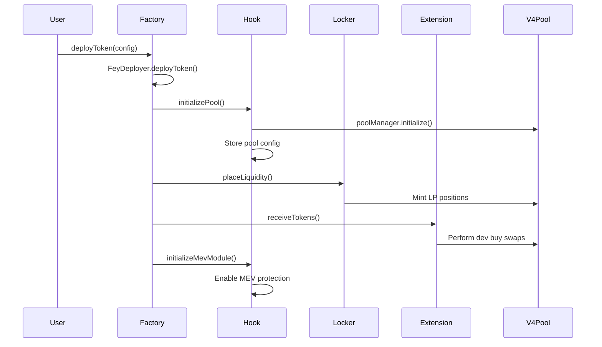

# FEY Protocol Documentation


## Executive Summary

FEY Protocol is the first fully permissionless, user-owned launchpad built on Base that redistributes 100% of protocol fees to token stakers. Unlike traditional launchpads owned by corporations, FEY operates as decentralized public infrastructure where users gain real ownership through staking. The protocol features autonomous fee distribution, creator rewards, and a self-sustaining tokenomics model with a fixed 100B token supply.

Core mechanics include: automatic buyback and redistribution of trading fees to stakers, TOKEN/FEY pairing for all launches creating constant buy pressure, and permissionless smart contract operations requiring no governance intervention.

---

## Table of Contents

- [Contract Map & Addresses](#contract-map--addresses)
- [Architecture Overview](#architecture-overview)
- [Core Contracts](#core-contracts)
  - [Factory (Fey.sol)](#factory-feysol)
  - [FEY Token](#fey-token)
  - [Hook System](#hook-system)
  - [LP Locker](#lp-locker)
  - [Fee Locker](#fee-locker)
  - [Extensions](#extensions)
  - [MEV Module](#mev-module)
- [Runtime Flows](#runtime-flows)
  - [Token Deployment Flow](#token-deployment-flow)
  - [Swap Flow](#swap-flow)
  - [Fee & Reward Distribution](#fee--reward-distribution)
- [State Verification](#state-verification)
- [Admin & Security Model](#admin--security-model)
- [Operational Procedures](#operational-procedures)
- [Troubleshooting](#troubleshooting)
- [Appendix](#appendix)

---

## Contract Map & Addresses

| Contract | Role | Address | Status |
|----------|------|---------|---------|
| **Fey (Factory)** | Core factory for token deployment | `0x8EEF0dC80ADf57908bB1be0236c2a72a7e379C2d` | Active |
| **FeyToken** | Base token for all pairs | `0xD09cf0982A32DD6856e12d6BF2F08A822eA5D91D` | Active |
| **FeyHookStaticFeeV2** | Pool management & fee routing | `0x5B409184204b86f708d3aeBb3cad3F02835f68cC` | Active |
| **FeyPoolExtensionAllowlist** | Extension permission control | `0xFD549237CdEAbDc14438CAF3f3861e174fDEae46` | Active |
| **FeyLpLockerMultiple** | LP position management | `0x975aF6a738f502935AFE64633Ad3EA2A3eb3e7Fa` | Active |
| **FeyFeeLocker** | Fee storage & distribution | `0xf739FC4094F3Df0a1Be08E2925b609F3C3Aa13c6` | Active |
| **FeyUniv4EthDevBuy** | ETH dev buy extension | `0x173077c319c38bb08D4C4968014357fd518446b4` | Active |
| **FeyMevNoop** | MEV protection (no-op) | `0x2ebc0fA629b268dFA3d455b67027d507a562EAC0` | Active |

**Key References:**
- **Network**: Base Mainnet
- **Base Token**: FEY (`0xD09cf0982A32DD6856e12d6BF2F08A822eA5D91D`)
- **Main Pool**: FEY/WETH (`0xe155c517c53f078f4b443c99436e42c1b80fd2fb1b3508f431c46b8365e4f3f0`)
- **Fee Recipient**: `0x72f5565Ab147105614ca4Eb83ecF15f751Fd8C50`

---

## Architecture Overview

The FEY Protocol operates as a layered system:

```
┌─────────────────────────────────────────────┐
│                 User Layer                  │
│         (Traders, Token Creators)          │
└─────────────────────────────────────────────┘
                        │
┌─────────────────────────────────────────────┐
│              Extension Layer                │
│     (DevBuy, Future: Presale, Vesting)     │
└─────────────────────────────────────────────┘
                        │
┌─────────────────────────────────────────────┐
│               Factory Layer                 │
│        (Token Deploy, Pool Init)           │
└─────────────────────────────────────────────┘
                        │
┌─────────────────────────────────────────────┐
│               Hook Layer                    │
│    (Fee Management, MEV Protection)        │
└─────────────────────────────────────────────┘
                        │
┌─────────────────────────────────────────────┐
│             Uniswap V4 Core                 │
│         (Pool Management, Swaps)           │
└─────────────────────────────────────────────┘
```

### Core Value Flow

1. **Trading Fees**: 20% of LP fees → Factory → Fee Locker → Stakers
2. **LP Rewards**: Position fees → LP Locker → Split by BPS → Fee Locker
3. **Creator Rewards**: 1% of trading volume → Token creators in FEY
4. **Buyback Mechanism**: WETH fees → Automatic FEY buyback every 60s → Stakers

---

## Core Contracts

### Factory (Fey.sol)

**Address**: `0x8EEF0dC80ADf57908bB1be0236c2a72a7e379C2d`

The Factory is the central orchestrator for token deployments and system configuration.

#### Key Storage

```solidity
address public baseToken;           // FEY token address
bool public deprecated;             // Prevents new deploys (except bootstrap)
address public teamFeeRecipient;    // Fee destination
address public feeLocker;           // Fee storage contract
address public bootstrap;           // Bootstrap permissions
```

#### Critical Methods

| Method | Purpose | Access |
|--------|---------|---------|
| `deployToken()` | Deploy new token + pool | Public |
| `claimWethFees()` | Route WETH fees to recipient | Public |
| `claimBaseTokenFees()` | Route FEY fees to locker | Public |
| `setBaseToken()` | Set FEY as base (bootstrap only) | Owner/Admin/Bootstrap |
| `freezeTeamFeeRecipient()` | Lock fee recipient permanently | Owner |

#### Deployment Configuration

```solidity
struct DeploymentConfig {
    TokenConfig tokenConfig;        // Name, symbol, admin
    PoolConfig poolConfig;          // Hook, paired token, ticks
    LockerConfig lockerConfig;      // LP positions, reward splits
    MevModuleConfig mevModuleConfig; // MEV protection
    ExtensionConfig[] extensionConfigs; // Dev buy, etc.
}
```

---

### FEY Token

**Address**: `0xD09cf0982A32DD6856e12d6BF2F08A822eA5D91D`

Extended ERC20 with governance, permit, and Superchain bridge compatibility.

#### Key Features

- **Total Supply**: 100,000,000,000 FEY (100B tokens)
- **Governance**: ERC20Votes for future DAO functionality
- **Cross-chain**: IERC7802 Superchain token bridge support
- **Permits**: Gasless approvals via EIP-2612

#### Token Metadata

```solidity
function allData() external view returns (
    address originalAdmin,    // Immutable creator
    address admin,           // Current admin
    string memory image,     // Token image URL
    string memory metadata,  // JSON metadata
    string memory context    // Additional context
)
```

---

### Hook System

**Address**: `0x5B409184204b86f708d3aeBb3cad3F02835f68cC`

The Hook manages all pool interactions, fee collection, and protocol mechanics.

#### Fee Structure

| Fee Type | Rate | Direction | Destination |
|----------|------|-----------|-------------|
| **LP Fee** | Dynamic (per direction) | Both | Liquidity Providers |
| **Protocol Fee** | 20% of LP fee | Paired token only | Factory → Fee Locker |
| **MEV Fee** | Up to 80% (temporary) | Both | MEV Protection |

#### Key Storage

```solidity
mapping(PoolId => bool) public feyIsToken0;           // Token ordering
mapping(PoolId => address) public locker;             // LP position manager
mapping(PoolId => address) public mevModule;          // MEV protection
mapping(PoolId => address) public poolExtension;      // Extension hooks
mapping(PoolId => uint24) public feyFee;             // FEY → Paired fee
mapping(PoolId => uint24) public pairedFee;          // Paired → FEY fee
```

#### Swap Flow Hooks

1. **beforeSwap**: 
   - Set dynamic LP fee based on direction
   - Claim accumulated protocol fees
   - Trigger LP reward collection
   - Run MEV module (if enabled)

2. **afterSwap**:
   - Extract protocol fee from swap delta
   - Execute pool extensions
   - Update pool state

---

### LP Locker

**Address**: `0x975aF6a738f502935AFE64633Ad3EA2A3eb3e7Fa`

Manages liquidity positions and reward distribution for deployed tokens.

#### Position Configuration

```solidity
struct TokenRewardInfo {
    address token;                  // Token address
    PoolKey poolKey;               // Uniswap V4 pool
    uint256 positionId;            // NFT position ID
    uint256 numPositions;          // Number of LP positions
    uint16[] rewardBps;            // Reward split (basis points)
    address[] rewardAdmins;        // Admin addresses
    address[] rewardRecipients;    // Recipient addresses
}
```

#### Constraints

- **MAX_LP_POSITIONS**: 7 positions per token
- **MAX_REWARD_PARTICIPANTS**: 7 recipients per token  
- **Reward BPS**: Must sum to 10,000 (100%)
- **Tick Rules**: Must align with pool tick spacing

#### Reward Collection

```solidity
// Collect during hook execution (pool unlocked)
function collectRewardsWithoutUnlock(address token) external;

// Collect with pool lock/unlock cycle
function collectRewards(address token) external;
```

---

### Fee Locker

**Address**: `0xf739FC4094F3Df0a1Be08E2925b609F3C3Aa13c6`

Stores and manages fee claims for protocol participants.

#### Storage & Claims

```solidity
mapping(address feeOwner => mapping(address token => uint256 balance)) public feesToClaim;

// Store fees (called by authorized contracts)
function storeFees(address feeOwner, address token, uint256 amount) external;

// Claim accumulated fees
function claim(address feeOwner, address token) external;
```

#### Access Control

- **Depositors**: Only approved contracts can store fees
- **Vault Claims**: Special vault address can only claim for itself
- **Fee Owners**: Can claim their own accumulated fees

---

### Extensions

Extensions add functionality to token deployments. Currently deployed:

#### FeyUniv4EthDevBuy

**Address**: `0x173077c319c38bb08D4C4968014357fd518446b4`

Enables ETH-based token purchases during deployment.

**Flow**:
1. Receive ETH from deployment
2. Convert ETH → WETH (if needed)
3. Swap WETH → FEY (if paired token is FEY)
4. Swap paired token → new token
5. Transfer tokens to recipient

**Requirements**:
- `extensionBps` must be 0 (pure ETH buy, no token allocation)
- Must provide valid pool path for swaps
- Minimum output amount protection

---

### MEV Module

**Address**: `0x2ebc0fA629b268dFA3d455b67027d507a562EAC0`

Currently a no-op module that disables itself after first swap.

#### MEV Protection Model

- **Initialization**: MEV module enabled for new pools
- **Time Window**: 2-minute maximum operation window
- **Self-Disable**: Module can disable itself (no-op does this immediately)
- **Fee Limits**: MEV fees capped at 80% of swap amount
- **Liquidity Block**: No liquidity changes during MEV protection

---

## Runtime Flows

### Token Deployment Flow



#### Step-by-Step Process

1. **Token Creation**
   ```solidity
   FeyDeployer.deployToken(tokenConfig, TOKEN_SUPPLY);
   // Creates new FeyToken with 100B supply via CREATE2
   ```

2. **Pool Initialization**
   ```solidity
   hook.initializePool(newToken, baseToken, tickConfig, locker, mevModule, poolData);
   // Sets up Uniswap V4 pool with dynamic fees
   ```

3. **Liquidity Placement**
   ```solidity
   locker.placeLiquidity(lockerConfig, poolConfig, poolKey, poolSupply, token);
   // Mints up to 7 LP positions with reward splits
   ```

4. **Extension Execution**
   ```solidity
   extension.receiveTokens{value: ethAmount}(...);
   // Handles dev buys, airdrops, etc.
   ```

5. **MEV Module Activation**
   ```solidity
   hook.initializeMevModule(poolKey, mevModuleData);
   // Enables MEV protection for initial trading
   ```

---

### Swap Flow

#### beforeSwap Hook Execution

```solidity
function _beforeSwap(
    address sender,
    PoolKey calldata poolKey,
    IPoolManager.SwapParams calldata swapParams,
    bytes calldata swapData
) internal returns (bytes4, BeforeSwapDelta, uint24) {
    // 1. Set dynamic LP fee based on swap direction
    _setFee(poolKey, swapParams);
    
    // 2. Claim protocol fees from previous swaps
    _hookFeeClaim(poolKey);
    
    // 3. Trigger LP reward collection (without unlock)
    _lpLockerFeeClaim(poolKey);
    
    // 4. Run MEV module (can adjust fees)
    _runMevModule(poolKey, swapParams, swapData);
    
    // 5. Handle protocol fee extraction for specific cases
    return (selector, delta, 0);
}
```

#### afterSwap Hook Execution

```solidity
function _afterSwap(
    address sender,
    PoolKey calldata poolKey,
    IPoolManager.SwapParams calldata swapParams,
    BalanceDelta delta,
    bytes calldata swapData
) internal returns (bytes4, int128) {
    // 1. Extract protocol fees from remaining cases
    // 2. Run pool extensions (if enabled and sender != locker)
    // 3. Adjust deltas for protocol fee accounting
    return (selector, unspecifiedDelta);
}
```

#### Fee Extraction Matrix

| Swap Type | Extract In | Method |
|-----------|------------|---------|
| ExactIn FEY→Paired | beforeSwap | Reduce input amount |
| ExactOut Paired→FEY | beforeSwap | Increase output amount |
| ExactIn Paired→FEY | afterSwap | Reduce output via delta |
| ExactOut FEY→Paired | afterSwap | Increase input via delta |

---

### Fee & Reward Distribution

#### Protocol Fee Flow

```mermaid
graph LR
    A[Swap] --> B[Hook extracts 20% of LP fee]
    B --> C[Fee in paired token]
    C --> D[Factory.claimBaseTokenFees()]
    D --> E{feeLocker set?}
    E -->|Yes| F[FeeLocker.storeFees()]
    E -->|No| G[Direct transfer to teamFeeRecipient]
    F --> H[Stakers claim via FeeLocker.claim()]
```

#### LP Reward Flow

```mermaid
graph LR
    A[Trading Activity] --> B[LP fees accumulate in positions]
    B --> C[Locker.collectRewards()]
    C --> D[Extract fees from V4 positions]
    D --> E[Split by rewardBps]
    E --> F[FeeLocker.storeFees() for each recipient]
    F --> G[Recipients claim individually]
```

#### Automatic Buyback Mechanism

The protocol implements automatic FEY buybacks using accumulated WETH:

1. **WETH Accumulation**: Factory receives WETH from FEY/WETH pool fees
2. **Public Trigger**: Anyone can call `Factory.claimWethFees()`
3. **Buyback Execution**: WETH → teamFeeRecipient → Manual buyback → Staking contract
4. **Distribution**: Purchased FEY distributed to active stakers

---

## State Verification

### Core Contract Queries

```bash
# Check factory status
cast call 0x8EEF0dC80ADf57908bB1be0236c2a72a7e379C2d \
  "baseToken()(address)" --rpc-url https://mainnet.base.org

# Get FEY total supply  
cast call 0xD09cf0982A32DD6856e12d6BF2F08A822eA5D91D \
  "totalSupply()(uint256)" --rpc-url https://mainnet.base.org

# Check pool fees for FEY
cast call 0x5B409184204b86f708d3aeBb3cad3F02835f68cC \
  "feyFee(bytes32)(uint24)" 0xe155c517c53f078f4b443c99436e42c1b80fd2fb1b3508f431c46b8365e4f3f0 \
  --rpc-url https://mainnet.base.org
```

### Token Deployment Info

```bash
# Get deployment details for FEY token
cast call 0x8EEF0dC80ADf57908bB1be0236c2a72a7e379C2d \
  "tokenDeploymentInfo(address)((address,address,address,address[]))" \
  0xD09cf0982A32DD6856e12d6BF2F08A822eA5D91D \
  --rpc-url https://mainnet.base.org
```

### Fee Balances

```bash
# Check available fees for an address
cast call 0xf739FC4094F3Df0a1Be08E2925b609F3C3Aa13c6 \
  "availableFees(address,address)(uint256)" \
  [FEE_OWNER] [TOKEN_ADDRESS] \
  --rpc-url https://mainnet.base.org

# Check factory WETH balance
cast call 0x4200000000000000000000000000000000000006 \
  "balanceOf(address)(uint256)" \
  0x8EEF0dC80ADf57908bB1be0236c2a72a7e379C2d \
  --rpc-url https://mainnet.base.org
```

---

## Admin & Security Model

### Access Control Matrix

| Contract | Role | Permissions | Freezable |
|----------|------|-------------|-----------|
| **Factory** | Owner | Set all modules, admin functions | - |
| **Factory** | Admin | Set modules, claim fees | - |
| **Factory** | Bootstrap | Initial base token setup | ✓ |
| **Factory** | teamFeeRecipient | - | ✓ |
| **FeeLocker** | Owner | Add depositors, set vault | - |
| **FeeLocker** | Vault | Claim own fees only | - |
| **Hook** | Factory | Initialize pools, set base token | - |
| **Token** | Admin | Update metadata, image | - |
| **Token** | originalAdmin | Verify token only | - |

### Security Features

#### Freeze Mechanisms
```solidity
// Permanently lock fee recipient
factory.freezeTeamFeeRecipient();

// Permanently lock fee locker address  
factory.freezeFeeLocker();

// Bootstrap can only be released, not changed
hook.releaseBootstrapper();
```

#### Fee & Supply Caps
```solidity
uint24 public constant MAX_LP_FEE = 100_000;      // 10% max LP fee
uint24 public constant MAX_MEV_LP_FEE = 800_000;  // 80% max MEV fee  
uint256 public constant TOKEN_SUPPLY = 100_000_000_000e18; // Fixed 100B supply
```

#### MEV Protection
- **Time-Limited**: 2-minute maximum operation window
- **Self-Disabling**: Modules can turn themselves off
- **Fee-Capped**: Maximum 80% fee during MEV protection
- **Liquidity-Blocked**: No LP changes during MEV window

---

## Operational Procedures

### Fee Claim Operations

#### Manual Fee Claims
```bash
# Claim WETH fees (anyone can trigger)
cast send 0x8EEF0dC80ADf57908bB1be0236c2a72a7e379C2d \
  "claimWethFees()" \
  --private-key $PRIVATE_KEY --rpc-url https://mainnet.base.org

# Claim FEY fees (anyone can trigger) 
cast send 0x8EEF0dC80ADf57908bB1be0236c2a72a7e379C2d \
  "claimBaseTokenFees()" \
  --private-key $PRIVATE_KEY --rpc-url https://mainnet.base.org
```

#### Individual Fee Claims
```bash
# Claim personal fees from fee locker
cast send 0xf739FC4094F3Df0a1Be08E2925b609F3C3Aa13c6 \
  "claim(address,address)" $MY_ADDRESS $TOKEN_ADDRESS \
  --private-key $PRIVATE_KEY --rpc-url https://mainnet.base.org
```

### LP Reward Management

#### Trigger Reward Collection
```bash
# Collect rewards for a token (anyone can trigger)
cast send 0x975aF6a738f502935AFE64633Ad3EA2A3eb3e7Fa \
  "collectRewards(address)" $TOKEN_ADDRESS \
  --private-key $PRIVATE_KEY --rpc-url https://mainnet.base.org
```

#### Update Reward Recipients
```bash
# Update reward recipient (admin only)
cast send 0x975aF6a738f502935AFE64633Ad3EA2A3eb3e7Fa \
  "updateRewardRecipient(address,uint256,address)" \
  $TOKEN_ADDRESS $REWARD_INDEX $NEW_RECIPIENT \
  --private-key $ADMIN_KEY --rpc-url https://mainnet.base.org
```

### Extension Management

#### Enable/Disable Extensions
```bash
# Enable extension (owner/admin only)
cast send 0x8EEF0dC80ADf57908bB1be0236c2a72a7e379C2d \
  "setExtension(address,bool)" $EXTENSION_ADDRESS true \
  --private-key $OWNER_KEY --rpc-url https://mainnet.base.org
```

---

## Troubleshooting

### Common Issues

#### Pool has no extension effects
**Symptoms**: Pool extensions not executing during swaps
**Diagnosis**:
```bash
# Check if extension is enabled in allowlist
cast call 0xFD549237CdEAbDc14438CAF3f3861e174fDEae46 \
  "enabledExtensions(address)(bool)" $EXTENSION_ADDRESS \
  --rpc-url https://mainnet.base.org

# Check pool extension registration
cast call 0x5B409184204b86f708d3aeBb3cad3F02835f68cC \
  "poolExtension(bytes32)(address)" $POOL_ID \
  --rpc-url https://mainnet.base.org
```

#### No rewards distribution
**Symptoms**: LP rewards not reaching recipients
**Diagnosis**:
```bash
# Check token reward configuration
cast call 0x975aF6a738f502935AFE64633Ad3EA2A3eb3e7Fa \
  "tokenRewards(address)" $TOKEN_ADDRESS \
  --rpc-url https://mainnet.base.org

# Verify locker has positions
# Ensure collectRewards*() is being called regularly
```

#### Protocol fees not arriving
**Symptoms**: Expected fees not reaching fee locker
**Diagnosis**:
```bash
# Check hook fee claim path
# 1. Verify hook extracts fees in paired token  
# 2. Check factory balance of paired token
# 3. Ensure claimBaseTokenFees() is called
# 4. Verify fee locker configuration

cast call 0x8EEF0dC80ADf57908bB1be0236c2a72a7e379C2d \
  "feeLocker()(address)" --rpc-url https://mainnet.base.org
```

### Error Codes

| Error | Contract | Cause | Solution |
|-------|----------|-------|----------|
| `Deprecated` | Factory | Factory deprecated, bootstrap required | Use bootstrap address or wait for reactivation |
| `BaseTokenNotSet` | Hook/Factory | Base token not initialized | Complete bootstrap process |
| `MevModuleEnabled` | Hook | Trying to add liquidity during MEV window | Wait for MEV module to expire/disable |
| `ExtensionNotEnabled` | Factory | Extension not in allowlist | Add extension to allowlist first |
| `InvalidRewardBps` | LpLocker | Reward percentages don't sum to 10000 | Fix reward split configuration |

---

## Appendix

### Key Constants

```solidity
// Supply & Fees  
uint256 public constant TOKEN_SUPPLY = 100_000_000_000e18;  // 100B tokens
uint24 public constant MAX_LP_FEE = 100_000;               // 10% 
uint256 public constant PROTOCOL_FEE_NUMERATOR = 200_000;  // 20%
uint256 public constant BASIS_POINTS = 10_000;             // 100%

// Constraints
uint256 public constant MAX_EXTENSIONS = 10;               // Per deployment
uint256 public constant MAX_REWARD_PARTICIPANTS = 7;       // Per token
uint256 public constant MAX_LP_POSITIONS = 7;              // Per token
uint256 public constant MAX_MEV_MODULE_DELAY = 2 minutes;  // MEV protection window
```

### Pool ID Derivation

```solidity
// FEY/WETH pool ID calculation
PoolKey memory poolKey = PoolKey({
    currency0: Currency.wrap(0x4200000000000000000000000000000000000006), // WETH
    currency1: Currency.wrap(0xD09cf0982A32DD6856e12d6BF2F08A822eA5D91D), // FEY  
    fee: LPFeeLibrary.DYNAMIC_FEE_FLAG,                                    // 0x800000
    tickSpacing: 200,                                                      // Hook-specific
    hooks: IHooks(0x5B409184204b86f708d3aeBb3cad3F02835f68cC)            // Hook address
});

bytes32 poolId = keccak256(abi.encode(poolKey));
// Result: 0xe155c517c53f078f4b443c99436e42c1b80fd2fb1b3508f431c46b8365e4f3f0
```

### Data Structures

```solidity
// Core configuration structs
struct TokenConfig {
    string name;
    string symbol; 
    string image;
    string metadata;
    string context;
    address tokenAdmin;
    uint256 salt;
    uint256 originatingChainId;
}

struct PoolConfig {
    address hook;
    address pairedToken;
    int24 tickIfToken0IsFey;
    int24 tickSpacing;
    bytes poolData;
}

struct LockerConfig {
    address locker;
    int24[] tickLower;
    int24[] tickUpper;
    uint16[] positionBps;
    uint16[] rewardBps;
    address[] rewardAdmins;
    address[] rewardRecipients;
}

// FEY token rewards (from LP Locker query)
struct TokenRewardInfo {
    address token;              // 0xD09cf0982A32DD6856e12d6BF2F08A822eA5D91D
    PoolKey poolKey;           // Pool configuration
    uint256 positionId;        // 484132 (starting NFT ID)
    uint256 numPositions;      // 1 (single position)
    uint16[] rewardBps;        // [10000] (100% to single recipient)
    address[] rewardAdmins;    // [0xD2a5dCA128C2e37a4B687d64D01eE67dD3875768]
    address[] rewardRecipients; // [0x72f5565Ab147105614ca4Eb83ecF15f751Fd8C50]
}
```

### Function Signatures

```solidity
// Factory key functions
function deployToken(DeploymentConfig memory) external payable returns (address);
function claimWethFees() external;
function claimBaseTokenFees() external; 
function setBaseToken(address) external;

// Hook key functions  
function initializePool(address,address,int24,int24,address,address,bytes) external returns (PoolKey memory);
function mevModuleSetFee(PoolKey calldata, uint24) external;

// Fee Locker functions
function storeFees(address,address,uint256) external;
function claim(address,address) external;
function availableFees(address,address) external view returns (uint256);

// LP Locker functions
function collectRewards(address) external;
function collectRewardsWithoutUnlock(address) external;
function tokenRewards(address) external view returns (TokenRewardInfo memory);
```

---

**Generated with Claude Code - FEY Protocol Documentation v1.0**

*For questions or contributions, contact the FEY Protocol team or submit issues via the appropriate channels.*