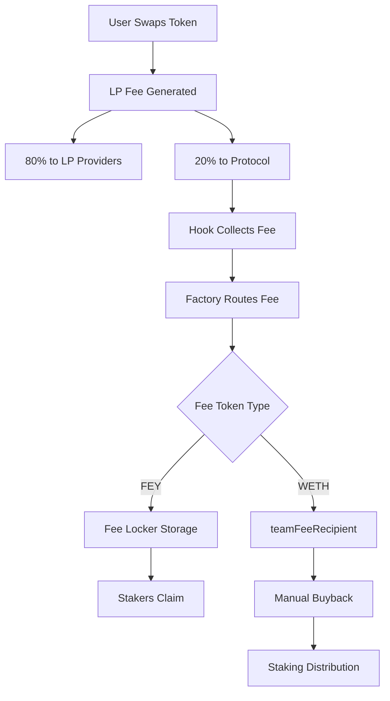
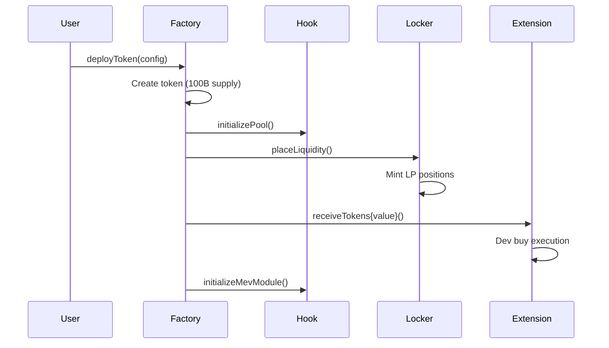
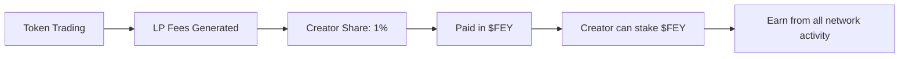
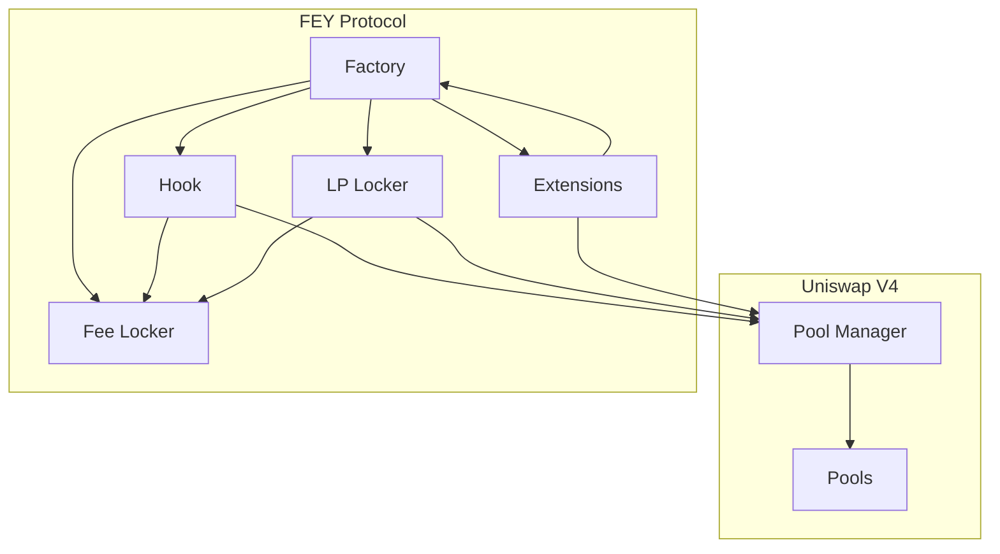

# Protocol Overview

FEY Protocol is built as a layered system on top of Uniswap V4, creating the first fully permissionless, user-owned launchpad. This page explains the high-level architecture and how all components work together.

## System Architecture

```
┌─────────────────────────────────────────────┐
│                 User Layer                  │
│         (Traders, Token Creators)          │
└─────────────────────────────────────────────┘
                        │
┌─────────────────────────────────────────────┐
│              Extension Layer                │
│     (DevBuy, Future: Presale, Vesting)     │
└─────────────────────────────────────────────┘
                        │
┌─────────────────────────────────────────────┐
│               Factory Layer                 │
│        (Token Deploy, Pool Init)           │
└─────────────────────────────────────────────┘
                        │
┌─────────────────────────────────────────────┐
│               Hook Layer                    │
│    (Fee Management, MEV Protection)        │
└─────────────────────────────────────────────┘
                        │
┌─────────────────────────────────────────────┐
│             Uniswap V4 Core                 │
│         (Pool Management, Swaps)           │
└─────────────────────────────────────────────┘
```

### Layer Responsibilities

**User Layer**
- Token creators deploy new projects
- Traders swap tokens and provide liquidity
- Stakers earn protocol fees

**Extension Layer**  
- Modular functionality for deployments
- Dev buys, airdrops, presales, vesting
- Permissioned through allowlist contract

**Factory Layer**
- Central orchestrator for deployments
- Coordinates token creation and pool setup
- Manages system configuration

**Hook Layer**
- Integrates with Uniswap V4 pools
- Handles fee collection and distribution
- Provides MEV protection and extensions

**Uniswap V4 Core**
- Decentralized exchange infrastructure
- Pool management and swap execution
- Liquidity position handling

## Core Value Flows

### 1. Fee Distribution Flow



### 2. Token Deployment Flow



### 3. Creator Reward Flow



## Network Economics

### Fixed Supply Model

FEY operates with a fixed token supply that creates deflationary pressure:

- **Total Supply**: 100,000,000,000 $FEY (100B tokens, fixed)
- **No Inflation**: No new tokens ever created
- **Buyback Pressure**: WETH fees converted to $FEY and distributed
- **Burn Potential**: Future governance could implement fee burns

### Value Accrual Mechanisms

**Direct Fee Distribution**
- 20% of all LP fees flow to protocol
- 100% redistribution to $FEY stakers
- Immediate value accrual from network activity

**Automatic Buybacks**
- WETH fees trigger $FEY market purchases
- Reduces circulating supply
- Creates consistent buy pressure

**Creator Alignment**
- All creator rewards paid in $FEY
- Successful creators become $FEY holders
- Long-term network alignment

### Network Effects

As FEY grows, it creates self-reinforcing loops:

1. **More Tokens** → More trading volume
2. **More Volume** → Higher protocol fees → Better staking returns
3. **Better Returns** → More $FEY demand → Higher price
4. **Higher Price** → Better creator rewards → Attracts more creators
5. **Loop continues** → Strengthening network effects

## Technical Architecture

### Contract Interaction Map



### Key Design Principles

**Permissionless Operations**
- No governance required for core functions
- Automatic fee distribution via smart contracts
- Public functions for system maintenance

**Modular Architecture**  
- Extensible through approved extensions
- Swappable components (lockers, MEV modules)
- Clean separation of concerns

**Uniswap V4 Native**
- Built specifically for V4's hook system
- Leverages dynamic fees and advanced pool features
- Designed for V4's gas efficiency improvements

**Security First**
- Multiple layers of access controls
- Freeze mechanisms for critical parameters
- Capped fees and MEV protection limits

## Integration Points

### For Users

**Token Stakers**
- Interface: Fee Locker contract
- Action: Stake $FEY, claim accumulated fees
- Rewards: Protocol fees from all network activity

**Token Creators**
- Interface: Factory contract
- Action: Deploy tokens with configuration
- Rewards: Creator fees in $FEY, LP rewards

**Traders**
- Interface: Uniswap V4 pools
- Action: Swap tokens, provide liquidity  
- Benefits: MEV protection, dynamic fees

### For Developers

**Extension Builders**
- Interface: IFeyExtension interface
- Integration: Allowlist approval process
- Capabilities: Custom deployment logic

**Frontend Developers**
- Interface: Factory and Hook contracts
- Queries: Token info, pool state, fees
- Actions: Deployment, trading, staking

**Protocol Integrators**
- Interface: All contract ABIs
- Monitoring: Event tracking, fee collection
- Automation: Reward triggers, buybacks

---

## Next Steps

Explore specific components:

- **Token Mechanics**: [Tokenomics →](/architecture/tokenomics)
- **Contract Details**: [Contract Map →](/architecture/contracts)  
- **Fee System**: [Fee Distribution →](/architecture/fees)
- **Core Contracts**: [Factory Contract →](/contracts/factory)