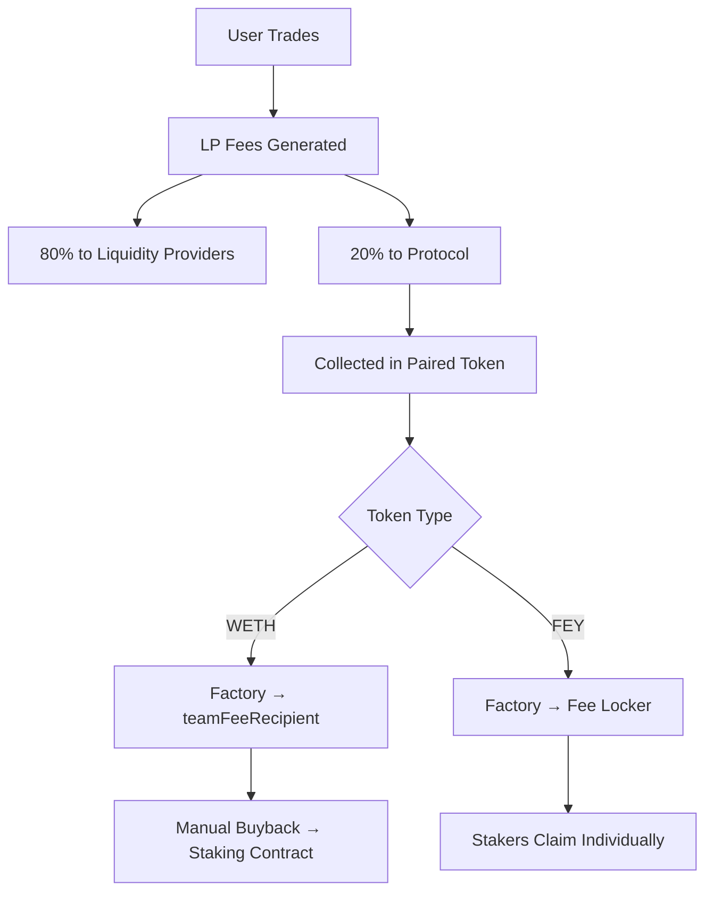

# Key Concepts

Understanding these core concepts will help you grasp how FEY Protocol creates a self-sustaining, user-owned launchpad network.

## Permissionless Ownership

Traditional launchpads are **permissioned** - the company controls fee distribution, can change revenue sharing, and owns all decision-making power. FEY is **permissionless** - all core operations happen automatically through smart contracts without any central control.

:::info[True Ownership]
When you hold $FEY, you own part of the protocol infrastructure itself. This is similar to holding BTC (ownership in Bitcoin network) or ETH (ownership in Ethereum network), not just utility tokens.
:::

## Fee Distribution Model

### How Fees Flow

### Automatic Distribution

- **LP Fees**: Standard Uniswap V4 fees go to liquidity providers (80%)
- **Protocol Fees**: 20% of LP fees automatically route to the protocol
- **Collection**: Fees collected in the paired token (FEY or WETH)
- **Distribution**: 100% flows back to stakers through permissionless contracts

## TOKEN/FEY Pairing Model

### Why FEY Pairs?

All tokens deployed on FEY pair with $FEY rather than ETH or stablecoins. This creates:

- **Buy Pressure**: Every trade creates demand for $FEY
- **Network Effects**: As more tokens launch, $FEY becomes more valuable
- **Creator Alignment**: Token creators earn rewards in $FEY, aligning them with protocol success

### Bootstrap Exception

The $FEY token itself pairs with WETH to provide the base liquidity for the entire system. This WETH/FEY pool is the only exception to the FEY-pairing rule.

## Staking & Reward Mechanics

### Staking Benefits

When you stake $FEY, you receive:
- **Protocol Fees**: From all trading activity across the network
- **LP Rewards**: From liquidity positions managed by the protocol
- **Buyback Distribution**: From automatic WETH→FEY conversions

### Early Participant Advantage

Since staking rewards are distributed proportionally, early stakers receive higher relative rewards because:
- Fewer total stakers = larger share of fees
- Growing network activity = increasing absolute rewards
- Fixed token supply = no dilution from new issuance

## Creator Rewards System

### How Creators Earn

Token creators receive rewards through multiple mechanisms:

1. **Direct Creator Fees**: 1% of trading volume in their token
2. **LP Position Rewards**: Fees from protocol-managed liquidity positions
3. **Network Participation**: All rewards paid in $FEY, giving creators exposure to network growth

### Success Alignment

This model aligns creator success with network success:
- Successful tokens generate more trading volume
- More volume = more $FEY rewards for creators
- Creators become $FEY stakeholders, incentivized to promote the network

## Automatic Buyback Mechanism

### WETH → FEY Conversion

The protocol implements automatic buybacks:

1. **WETH Accumulation**: Factory receives WETH fees from FEY/WETH pool
2. **Public Triggers**: Anyone can call `claimWethFees()` to release accumulated WETH
3. **Manual Buyback**: WETH goes to `teamFeeRecipient` who performs market buyback
4. **Distribution**: Purchased $FEY flows to staking contract for distribution

:::warning[Manual Step]
The buyback mechanism currently includes one manual step where `teamFeeRecipient` performs the actual WETH→FEY swap. This will be automated in future protocol upgrades.
:::

## MEV Protection

### Fair Launch Protection

New token pools receive MEV protection during launch:
- **Time Window**: 2-minute maximum protection period
- **Fee Adjustment**: MEV module can increase fees up to 80% to deter MEV
- **Auto-Disable**: Protection automatically expires or can be disabled by the module
- **Liquidity Block**: No liquidity changes allowed during protection window

### No-Op Default

The current MEV module is a "no-op" that immediately disables itself, serving as a template for future MEV protection implementations.

## Extension System

### Modular Functionality

FEY uses an extension system to add functionality:
- **Dev Buy Extensions**: Allow ETH purchases during token deployment
- **Future Extensions**: Airdrops, vesting, presales, etc.
- **Permissioned Extensions**: Must be approved through allowlist contract
- **Composable**: Multiple extensions can be used in single deployment

### Current Extensions

**FeyUniv4EthDevBuy** (`0x173077c319c38bb08D4C4968014357fd518446b4`)
- Enables ETH-based token purchases during deployment
- Automatically swaps ETH → WETH → FEY → new token
- Pure buy mechanism (no token allocation to extension)

## Network Economics

### Fixed Supply Model

- **Total Supply**: 100,000,000,000 $FEY (100B tokens)
- **No Inflation**: Fixed supply, no new issuance
- **Deflationary Pressure**: Automatic buybacks reduce circulating supply
- **Value Accrual**: All network growth benefits existing holders

### Self-Sustaining Loop

1. More tokens deploy on FEY → More trading volume
2. More volume → More protocol fees → More rewards for stakers  
3. Higher staking rewards → More demand for $FEY
4. Higher $FEY price → Better creator rewards → Attracts more creators
5. Loop repeats, creating network effects

---

## Next Steps

Now that you understand the key concepts:

- **Start using FEY**: [Getting Started →](/getting-started)
- **Deep dive into architecture**: [Protocol Overview →](/architecture/overview)  
- **Learn about tokenomics**: [Token Mechanics →](/architecture/tokenomics)
- **Explore the contracts**: [Core Contracts →](/contracts/factory)