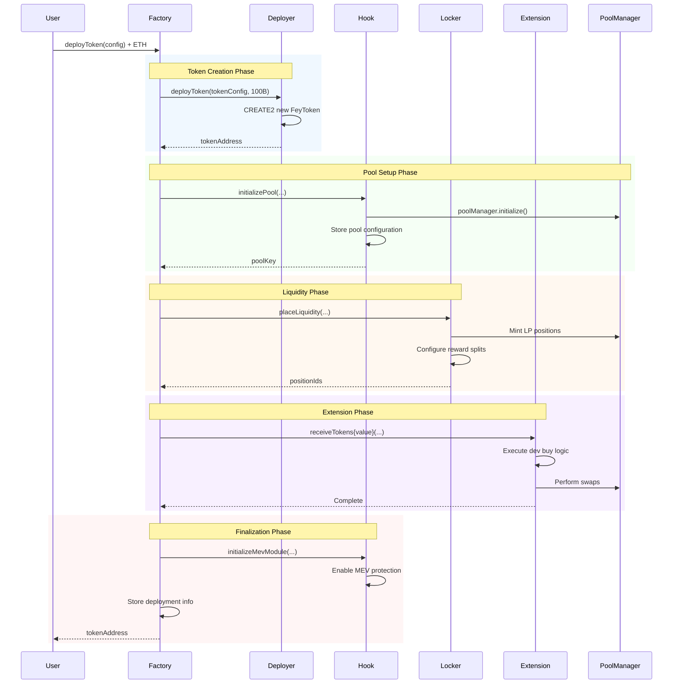

# Token Deployment

Learn how to deploy tokens on the FEY Protocol, including configuration options, best practices, and the complete deployment flow.

## Overview

Token deployment on FEY Protocol is a comprehensive process that creates not just a token, but an entire trading ecosystem with liquidity positions, fee distribution, and optional extensions.

### What Gets Created

Every deployment creates:
- **ERC20 Token**: 100B supply with governance and cross-chain features
- **Uniswap V4 Pool**: TOKEN/FEY pair with dynamic fees
- **LP Positions**: Up to 7 concentrated liquidity positions
- **Reward System**: Configurable fee splits to multiple recipients
- **MEV Protection**: 2-minute protection window for fair launch
- **Extensions**: Optional dev buy, presale, or other functionality

## Deployment Configuration

### TokenConfig

```typescript
interface TokenConfig {
  name: string;                 // Token name (e.g., "My Token")
  symbol: string;               // Token symbol (e.g., "MTK")
  image: string;                // Image URL for token logo
  metadata: string;             // JSON metadata URL
  context: string;              // Additional context/description
  tokenAdmin: address;          // Admin address for token management
  salt: uint256;                // CREATE2 salt for deterministic address
  originatingChainId: uint256;  // Chain where token is first created
}
```

### PoolConfig

```typescript
interface PoolConfig {
  hook: address;                // FEY Hook address
  pairedToken: address;         // Paired token (overridden to FEY)
  tickIfToken0IsFey: int24;     // Starting tick if FEY is token0
  tickSpacing: int24;           // Tick spacing (200 for FEY pools)
  poolData: bytes;              // Encoded pool initialization data
}
```

### LockerConfig

```typescript
interface LockerConfig {
  locker: address;              // LP Locker contract address
  tickLower: int24[];           // Lower ticks for LP positions
  tickUpper: int24[];           // Upper ticks for LP positions
  positionBps: uint16[];        // Token allocation per position (basis points)
  rewardBps: uint16[];          // Fee split per recipient (basis points)
  rewardAdmins: address[];      // Admin addresses for each reward
  rewardRecipients: address[];  // Recipient addresses for fees
}
```

### ExtensionConfig

```typescript
interface ExtensionConfig {
  extension: address;           // Extension contract address
  extensionBps: uint16;         // Token allocation to extension
  msgValue: uint256;           // ETH to send to extension
  extensionData: bytes;        // Extension-specific configuration
}
```

## Step-by-Step Deployment

### 1. Prepare Configuration

Before deployment, gather all required information:

```javascript
const deploymentConfig = {
  tokenConfig: {
    name: "My Amazing Token",
    symbol: "MAT",
    image: "https://example.com/token-logo.png",
    metadata: "https://example.com/metadata.json",
    context: "A revolutionary token for...",
    tokenAdmin: "0x1234...5678", // Your address
    salt: "0x1234567890abcdef",
    originatingChainId: 8453 // Base mainnet
  },
  poolConfig: {
    hook: "0x5B409184204b86f708d3aeBb3cad3F02835f68cC",
    pairedToken: "0x0000000000000000000000000000000000000000", // Will be set to FEY
    tickIfToken0IsFey: -276326, // Starting price tick
    tickSpacing: 200,
    poolData: "0x..." // Encoded pool data
  },
  lockerConfig: {
    locker: "0x975aF6a738f502935AFE64633Ad3EA2A3eb3e7Fa",
    tickLower: [-887272], // Single full-range position
    tickUpper: [887272],
    positionBps: [10000], // 100% of tokens
    rewardBps: [10000], // 100% of rewards to one recipient
    rewardAdmins: ["0x1234...5678"],
    rewardRecipients: ["0x1234...5678"]
  },
  mevModuleConfig: {
    mevModule: "0x2ebc0fA629b268dFA3d455b67027d507a562EAC0",
    mevModuleData: "0x"
  },
  extensionConfigs: [
    {
      extension: "0x173077c319c38bb08D4C4968014357fd518446b4", // Dev buy
      extensionBps: 0, // No token allocation for dev buy
      msgValue: ethers.parseEther("1.0"), // 1 ETH for dev buy
      extensionData: encodedDevBuyData
    }
  ]
};
```

### 2. Encode Extension Data

For dev buy extension:

```javascript
function encodeDevBuyData(recipient, pairedTokenPoolKey, pairedTokenAmountOutMinimum) {
  return ethers.AbiCoder.defaultAbiCoder().encode(
    ['address', 'tuple(address,address,uint24,int24,address)', 'uint128'],
    [recipient, pairedTokenPoolKey, pairedTokenAmountOutMinimum]
  );
}
```

### 3. Calculate Required ETH

```javascript
// Calculate total ETH needed for extensions
const totalEthRequired = deploymentConfig.extensionConfigs.reduce(
  (sum, ext) => sum + ext.msgValue,
  0n
);
```

### 4. Execute Deployment

```javascript
// Deploy token with configuration
const factory = new ethers.Contract(
  "0x8EEF0dC80ADf57908bB1be0236c2a72a7e379C2d",
  factoryABI,
  signer
);

const tx = await factory.deployToken(deploymentConfig, {
  value: totalEthRequired, // ETH for extensions
  gasLimit: 5000000 // Deployment requires significant gas
});

const receipt = await tx.wait();
```

### 5. Extract Token Address

```javascript
// Get token address from TokenCreated event
const tokenCreatedEvent = receipt.logs.find(
  log => log.fragment?.name === 'TokenCreated'
);

const tokenAddress = tokenCreatedEvent.args.tokenAddress;
console.log("Token deployed at:", tokenAddress);
```

## Deployment Flow



## Best Practices

### Token Configuration

**Naming:**
- Use clear, memorable names
- Avoid special characters
- Keep symbols short (2-5 characters)

**Metadata:**
- Host images on reliable CDNs
- Use standard token metadata format
- Include comprehensive descriptions

**Admin Address:**
- Use a secure, controlled address
- Consider multi-sig for important tokens
- Plan for potential admin transfers

### Liquidity Setup

**Position Configuration:**
- Full-range positions for maximum liquidity
- Consider multiple positions for price ranges
- Ensure position basis points sum to 10,000

**Reward Distribution:**
- Plan long-term reward recipients
- Use secure admin addresses
- Consider decentralized governance

**Fee Optimization:**
- Understand tick spacing requirements
- Plan starting price carefully
- Consider market conditions

### Extension Usage

**Dev Buy Configuration:**
- Set reasonable ETH amounts
- Configure slippage protection
- Use secure recipient addresses

**Future Extensions:**
- Plan for additional functionality
- Keep extension allocations reasonable
- Test thoroughly before mainnet

## Common Patterns

### Standard Fair Launch

```javascript
// Simple fair launch with dev buy
{
  extensionConfigs: [
    {
      extension: DEV_BUY_EXTENSION,
      extensionBps: 0, // No token allocation
      msgValue: ethers.parseEther("5.0"), // 5 ETH buy
      extensionData: encodeDevBuyData(deployer, feyWethPool, minOut)
    }
  ],
  lockerConfig: {
    rewardBps: [10000], // 100% to deployer
    rewardRecipients: [deployer]
  }
}
```

### Community Launch

```javascript
// Launch with community treasury
{
  lockerConfig: {
    rewardBps: [5000, 5000], // 50/50 split
    rewardRecipients: [deployer, communityTreasury],
    rewardAdmins: [deployer, communityMultisig]
  }
}
```

### Team Launch

```javascript
// Launch with team allocation
{
  extensionConfigs: [
    {
      extension: TEAM_VESTING_EXTENSION,
      extensionBps: 1000, // 10% to team vesting
      msgValue: 0,
      extensionData: encodeVestingData(teamAddresses, vestingSchedule)
    }
  ],
  lockerConfig: {
    rewardBps: [7000, 3000], // 70% deployer, 30% team
    rewardRecipients: [deployer, teamTreasury]
  }
}
```

## Monitoring Deployment

### Track Progress

```javascript
// Monitor deployment transaction
const deploymentTx = await factory.deployToken(config, { value: ethValue });

// Wait for confirmation
const receipt = await deploymentTx.wait(2); // Wait for 2 confirmations

// Extract all relevant events
const events = receipt.logs.map(log => {
  try {
    return factory.interface.parseLog(log);
  } catch (e) {
    return null;
  }
}).filter(Boolean);

console.log("Deployment events:", events);
```

### Verify Deployment

```javascript
// Check token deployment info
const deploymentInfo = await factory.tokenDeploymentInfo(tokenAddress);
console.log("Locker:", deploymentInfo.locker);
console.log("Hook:", deploymentInfo.hook);
console.log("Extensions:", deploymentInfo.extensions);

// Verify token properties
const token = new ethers.Contract(tokenAddress, tokenABI, provider);
const totalSupply = await token.totalSupply();
const name = await token.name();

console.log(`${name}: ${totalSupply.toString()} total supply`);
```

## Troubleshooting

### Common Issues

**Deployment Reverts:**
- Check all arrays have matching lengths
- Ensure reward BPS sum to 10,000
- Verify extension configurations
- Check ETH amount covers all extensions

**MEV Module Issues:**
- Ensure MEV module is enabled in factory
- Check module initialization data
- Verify module contract compatibility

**Extension Failures:**
- Verify extension is enabled in allowlist
- Check extension data encoding
- Ensure sufficient ETH for extensions

### Error Messages

| Error | Cause | Solution |
|-------|-------|----------|
| `Deprecated` | Factory deprecated | Wait for reactivation or use bootstrap |
| `BaseTokenNotSet` | No base token configured | Complete protocol bootstrap |
| `ExtensionNotEnabled` | Extension not approved | Add to allowlist first |
| `InvalidRewardBps` | Reward BPS don't sum to 10000 | Fix reward distribution |
| `ExtensionMsgValueMismatch` | ETH amount mismatch | Match ETH to extension configs |

---

## Next Steps

After deployment:

- **Monitor Trading**: [Trading & Swaps →](/flows/swapping)
- **Claim Rewards**: [Fee Collection →](/flows/fees)  
- **Track Performance**: [State Queries →](/guides/queries)
- **Manage Token**: [Admin Operations →](/support/admin)